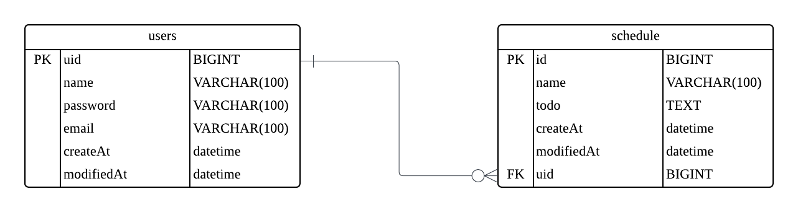

API 명세
==================================
| 기능       | Method | URL             | request                                                                                                                                                             | response                                                                                                                                                                                                                                                          | 상태코드       |
|----------|--------|-----------------|---------------------------------------------------------------------------------------------------------------------------------------------------------------------|-------------------------------------------------------------------------------------------------------------------------------------------------------------------------------------------------------------------------------------------------------------------|------------|
| 유저 생성    | POST   | /users          | `{"name":"testUser1", "password":"asdasdasd", "email":"asdfg@hjk.qwe"}`                                                                                             | `{"uid":1, "name":"testUser1", "email": "asdfg@hjk.qwe", "createAt":"2025-05-25T17:07:03", "modifiedAt":"2025-05-25T17:07:03"}`                                                                                                                                   | 201: 정상 생성 |
| 일정 생성    | POST   | /schedules      | `{"todo":"works1", "name":"user1", "password":"asdasdasd", "uid":1}`  name 생략 시 등록된 user의 name으로 자동 등록                                                          | `{"id":"1", "todo":"works1", "name":"user1", "createAt":"2025-05-25T17:09:10", "modifiedAt":""2025-05-25T17:09:10", "uid": 1}`                                                                                                                                    | 201: 정상 생성 |
| 전체 일정 조회 | GET    | /schedules      | 요청 쿼리 p: 페이지 번호, 기본 값 1 pSize: 페이지의 크기, 기본 값 5 name: 스케줄의 name이 일치하는 데이터 찾기 modifiedAt: 스케줄의 modifiedAt이 일치하는 데이터 찾기 uid: 스케줄의 uid가 일치하는 데이터 찾기 | `[{"id":"1", "todo":"works1", "name":"user1", "createAt":"2025-05-25T17:09:10", "modifiedAt":""2025-05-25T17:09:10", "uid": 1}, {"id":"1", "todo":"works2", "name":"testUser2", "createAt":"2025-05-25T17:32:51", "modifiedAt":"2025-05-25T17:32:51", "uid": 2}]` | 200: 정상 조회 |
| 선택 일정 조회 | GET    | /schedules/{id} | -                                                                                                                                                                   | `{"id":"1", "todo":"works1", "name":"user1", "createAt":"2025-05-25T17:09:10", "modifiedAt":"2025-05-25T17:09:10", "uid": 1}`                                                                                                                                     | 200: 정상 조회 |
| 선택 일정 수정 | PATCH  | /schedules/{id} | `{"todo":"updatedcontent1", "name":"updated1", "password":"asdasdasd"}`    name, todo 둘다 입력하지 않을 시 에러 반환                                                        | `{"id":"1", "todo":"updatedcontent1", "name":"updated1", "createAt":"2025-05-25T17:09:10", "modifiedAt":"2025-05-25T17:12:25", "uid": 1}`                                                                                                                         | 200: 정상 변경 |
| 선택 일정 삭제 | DELETE | /schedules/{id} | `{"password":"asdasd"}`                                                                                                                                             | -                                                                                                                                                                                                                                                                 | 204: 정상 삭제 |
ERD
===================================

